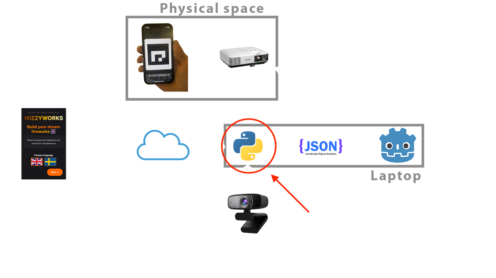

# WizzyWorks Bridge

This is a Python application that bridges WebSocket communication with ArUco marker detection, and is part of the WizzyWorks virtual firework experience from the course DH2413 Advanced Graphics and Interaction in KTH, 2025. 

It is intended for this system to run alongside other components for the WizzyWorks project, as shown in the diagram below. The system listens for ArUco marker IDs via WebSocket, then monitors a video feed for those specific markers. When a marker is detected, it triggers a custom action, which in this case, create and store firework data in json and png format for the graphics project to read.



## Features

- **WebSocket Integration**: Receives ArUco marker ID and associated data via WebSocket
- **Real-time ArUco Detection**: Continuously scans video feed for ArUco markers
- **Component-based Architecture**: Modular design with separate scanner and WebSocket components
- **Visual Feedback**: Live video feed with marker detection overlay and status information

## Architecture

### Components

1. **`aruco_scanner.py`**: ArUco marker detection
2. **`websocket_client.py`**: WebSocket client for receiving marker data
3. **`main.py`**: Main application coordinating all components

### Data Flow

1. WebSocket server sends ArUco marker ID with associated data
2. Bridge receives and stores the target marker ID
3. Camera continuously scans for ArUco markers
4. When a target marker is detected, triggers custom action
5. Action results can be sent back via WebSocket

## Installation

1. **Clone the repository**:

   ```bash
   git clone <repository-url>
   cd wizzyworks-bridge
   ```

2. **Install dependencies**:

   ```bash
   pip install -r requirements.txt
   ```

3. **Verify camera access**:
   Make sure your camera is connected and accessible by OpenCV.

## Quick Start

1. Ensure a WebSocket server is running (see Test Server section below).

2. Start the Bridge Application:

   ```bash
   python main.py
   ```

   This will:

   - Connect to the WebSocket server
   - Start the camera feed
   - Begin monitoring for ArUco markers

3. Test with Physical Markers:

   - Generate ArUco markers using online tools or OpenCV
   - Print markers with IDs that match your WebSocket commands
   - Show markers to the camera
   - Watch for trigger events in the console

## Configuration

### Command Line Arguments

You can override settings using command-line arguments:

```bash
# Use a different camera
python main.py --camera 1

# Use a different WebSocket URI
python main.py --websocket-uri ws://localhost:8080/

# Use both
python main.py --camera 1 --websocket-uri ws://localhost:8080/

# Short forms
python main.py -c 1 -w ws://localhost:8080/

# Show help
python main.py --help
```

### Environment Variables

Create a `.env` file in the project root to configure the application:

**Note:** The following environment variables are mandatory for the application to function correctly: `WEBSOCKET_URI` and `SAVE_DIR`.

```bash
# Copy .env.example to .env and modify as needed
cp .env.example .env
```

Example `.env` file:

```bash
# Mandatory: WebSocket URI for server connection
WEBSOCKET_URI=wss://wizzyworks-server.redbush-85e59e10.swedencentral.azurecontainerapps.io

# Camera Configuration (optional, defaults to 0)
CAMERA_INDEX=0

# Mandatory: Path to wizzyworks-graphics project directory for saving firework data
SAVE_DIR=path/to/wizzyworks-graphics/godot-visuals/json_fireworks

# For local development:
# WEBSOCKET_URI=ws://localhost:8080/
# CAMERA_INDEX=1
```

### Camera Settings

In `aruco_scanner.py`, you can adjust:

```python
# Camera resolution
cap.set(cv2.CAP_PROP_FRAME_WIDTH, 1920)
cap.set(cv2.CAP_PROP_FRAME_HEIGHT, 1080)

# Exposure settings (for bright markers in dark rooms)
cap.set(cv2.CAP_PROP_AUTO_EXPOSURE, 1)
cap.set(cv2.CAP_PROP_EXPOSURE, 100)
```

## WebSocket Message Format

The system expects JSON messages in this format:

```json
{
  "id": 5,
  "data": "any_data_here"
}
```

## Test Server

For testing and development, use the included test server:

1. Start the Test Server:

   ```bash
   python test_server.py
   ```

   This starts a WebSocket server on `ws://localhost:8080` with interactive mode.

2. Send Commands in the test server terminal:

   ```bash
   # Send a single ID with data
   send 1 red_button

   # Reset all stored IDs
   reset

   # Clear a specific ID
   clear 1
   ```

## Controls

When the video window is active:

- **`q`**: Quit the application
- **`r`**: Reset triggered markers (allows re-triggering)
